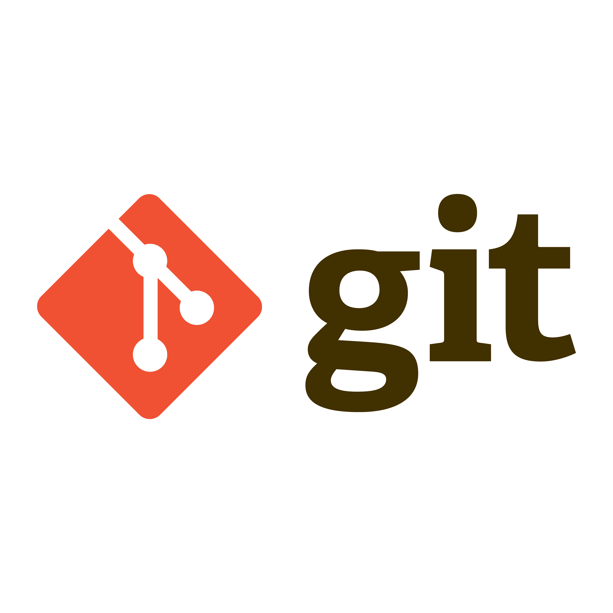

# 📚 DIO | Resumos Git e Github 📚

Meu resumo sobre as aulas da professora Eli do curso da DIO **"Suzano - Python Developer"**

##  GitHub da Eli


- [elidianaandrade](https://github.com/elidianaandrade?tab=repositories)
- [commits da eli](https://github.com/elidianaandrade/elidianaandrade/commits/main/)

# Conceitos

- **Repositório** (Repository) – Um diretório onde o Git armazena todo o histórico do projeto, incluindo commits, branches e arquivos versionados

- **Commit** – Um "snapshot" do código em um determinado momento. Cada commit tem um identificador único (hash) e pode conter mensagens descritivas

- **Branch** – Um ramo independente do repositório que permite desenvolver novas funcionalidades sem afetar o código principal. O branch principal geralmente é chamado de main (ou master)

- **Merge** – O processo de combinar mudanças de um branch para outro

- **Checkout** – Comando usado para mudar entre branches ou restaurar arquivos de versões anteriores

- **Clone** – Cópia de um repositório remoto para um computador local

- **Pull** – Atualiza o repositório local com as últimas mudanças do repositório remoto

- **Push** – Envia os commits locais para o repositório remoto

- **Staging Area** (Área de Preparação) – Um espaço intermediário onde as alterações são organizadas antes de serem commitadas

- **Blame** – Mostra quem fez a última modificação em cada linha de um arquivo

- **Tag** – Um marcador usado para identificar versões específicas no histórico do repositório

- **Fork** – Uma cópia de um repositório remoto em outra conta, geralmente usada para contribuir com projetos de código aberto

# 💻 Versionamento de código

## ⚙⚙ Sistemas de Controle de Versão

### Controlam as versões de um arquivo ao longo do tempo

- Registra o histórico de atualizações de um arquivo
- Gerencia quais foram as alterações, a data, autor...
- Organização, controle e segurança

### Tipos de Sistemas de Controle de Versão

- VCS Centralizado (CVCS)
- VCS Distribuído (DVCS) ----> Git

### VCS Distribuído

#### Clona o repositório completo, o que inclui o histórico de versões

- Cada clone é como um backup
- Possibilita um fluxo de trabalho flexível
- Possibilidade de trabalhar sem conexão à rede

#  O que é Git?

## Sistema de Controle de Versão Distribuído

- Gratuito e Open Source (Código aberto)
- Ramificações (Branching) e fusões (Merging) eficientes
- Leve e rápido

## Fluxo básico no Git
```
git clone
```
- Clona um repositório Git existente para um novo diretório (pasta) local

```
git commit 
```
- Grava alterações no seu repositório

```
git pull
```
- "Puxa" as alterações do repositório remoto para o local (busca e mescla)

```
git push
```
- "Empurra" as alterações do repositório local para o remoto

#  O que é GitHub?

### Plataforma de hospedagem de código para controle de versão com Git, e colaboração

# Diferença entre Git Bash e Git GUI

## Git Bash 🖥️
O Git Bash é um terminal que permite executar comandos Git no Windows, simulando um ambiente semelhante ao Linux. Ele é útil para usuários que preferem interagir com o Git via linha de comando (CLI).

### 📌 Principais características:

- Oferece um ambiente Unix/Linux no Windows
- Permite executar comandos do Git e alguns comandos do Linux
- Recomendado para quem deseja mais controle e flexibilidade

## Git GUI 🖱️
O Git GUI é uma interface gráfica para Git, permitindo realizar operações como commits, push e pull de forma visual, sem precisar usar a linha de comando.

### 📌 Principais características:

- Interface gráfica intuitiva
- Fácil para iniciantes que não querem usar comandos
- Permite visualizar alterações, fazer commits e gerenciar branches

# Comandos aprendidos nesta aula
```
git config

git config --global user.name "Seu Nome"

git config --global user.email "seu@email.com"

git config init.defaultBranch

git config --global init.defaultBranch "main"
```
# 🔧 Autenticando via Token

## Criando um repositório pelo GitHub

- Clicar no "+" no canto superior direito da tela
- "New repository"
- Dar um nome
- Definir privado
- Add a README file
- "Create repository"

## Simulação de tentativa de clonagem

- Clicar em "<> code"
- HTTPS
- Copiar a URL
- Ir no Git Bash
- git clone [URL do repositório]()
 
 Automaticamente será criado um clone desse repositório na pasta que está sendo manipulada pelo Git Bash

 ## Criando um Token

 - No GitHub
 - Clicar na foto no canto superior direito
 - Settings
 - Developer settings
 - Personal access tokens
 - tokens (classic)
 - Generate new token
 - Generate new token (classic)
 - Senha
 - Note = descrição do token
 - Expiration = depois de X dias vai expirar o token
 - Seleciona a opção "repo"
 - Generate token
 - Copia o token

 ## Salvando credenciais na máquina sem usar tokens

 - Git Bash
 - git config --global credential.helper store (permanentemente, apenas eu utilizo)
 - git config --global credential.helper cache (temporário)

 # Comandos aprendidos nessa aula

 ```
 git config --global --show-origin credential.helper
 ```
 - Para saber em qual lugar do computador o Git armazena as configurações definidas

 ```
cat [Nome do arquivo]
```
- Abre o arquivo pelo Git Bash

```
cd [Nome da pasta]/
```
- Entra na pasta para manipular no Git Bash

```
cd ..
```
- Volta uma pasta que está sendo manipulada
# 🔑 Autenticando via Chave SSH

### SSH = Secure Shell

- Protocolo de rede que possibilita que o computador local e o servidor remoto (GitHub) se conectem de forma segura e criptografada por meio da internet

## Como criar a Chave SSH

- No GitHub
- Clicar na sua foto
- Settings
- SSH and GPG Keys
- New SSH key

# 🖨 Criando e Clonando repositórios

## Existem duas formas de obter um repositório Git na sua máquina

- Transformando um diretório local que não está sob controle de versão, num repositório Git
- Clonando um repositório Git existente

## Criando uma pasta que será transformada em um repositório Git pelo terminal

```
mkdir [Nome da pasta a ser criada]
```
- Cria uma pasta pelo Git Bash

```
cd [Nome da pasta criada]/
```
- Entra na pasta

```
git init
```
- Transforma a pasta em um repositório Git

### Obs: O diretório ".git" é responsável por gerenciar os arquivos responsáveis pelo controle de versão

## Conectando o repositório local com o repo remoto

```
git remote add origin [URL do repositório remoto]
```

# ✅ Salvando alterações no repositório local

```
git status
```
- Mostra o status da nossa árvore de trabalho e da área de preparação (index), staging area

```
touch README.md
```
- Cria um arquivo vazio

### Após alterar o arquivo README.md 

```
git add README.md
```
- Adiciona o arquivo na área de preparação

```
git commit -m"[Descrição do commit]"
```
- Insere em um commit

```
git log
```
-  Exibe os commits, autor, email, e hash do commit

parei em "salvando alterações no repositorio local minuto 11:37